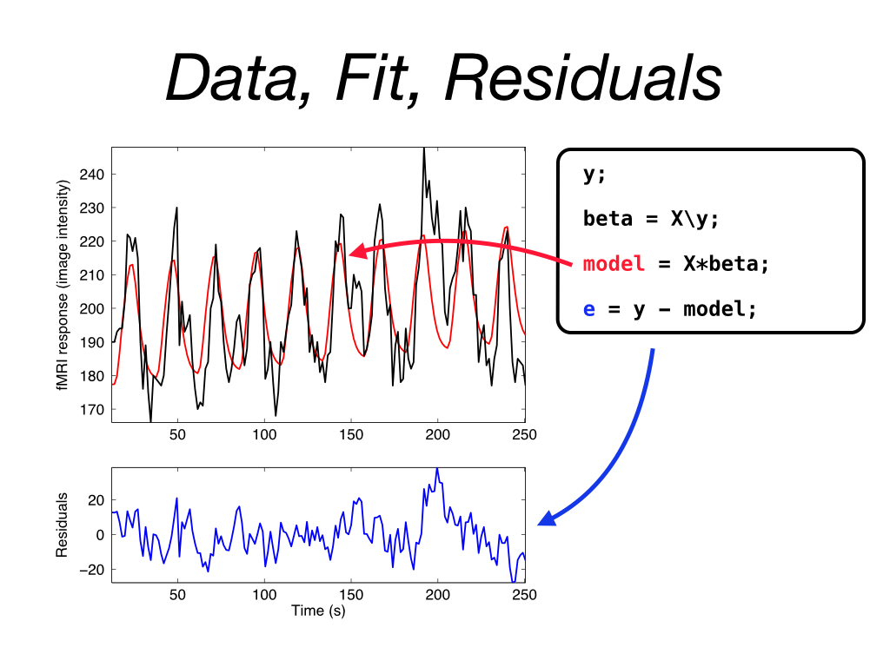

## Aim

In this unit we want to work through an example of linear regression, in particular the *estimation* part. The function ``linRegress()`` should be of the following form:

- ``linRegress( filename )``
- loads in  ``filename`` (timecourse.mat) which provides two variables:  ``t, timecourse``
- ``t`` is a matlab struct with two fields: ``t.s`` (time in seconds), ``t.vols`` (time in acquisition volumes)
- the function should trim the first ``n=8`` volumes from ``t`` and ``timecourse`` (these are often called “dummies”. Data is acquired, but no stimulus yet.)
- makes the design matrix (160 rows, 3 columns) using the function ``makeDesignMatrix()`` we worked on in unit 2. Where  ``blockOne = [ zeros(1,10) ones(1,6)];`` and ``n=10`` repeats
- ``plot``s ``timecourse`` as a function of ``t.s``
- finds: ``beta = X\y;``  using backslash or the slightly less preferable but more explicit ``beta = inv(X'*X)*(X')*y;``

- reports ``beta`` values on command line (``disp, sprintf, fprintf``)
- plots ``modelfit = X*beta`` on top of timecourse plot (same figure)

## Notes

